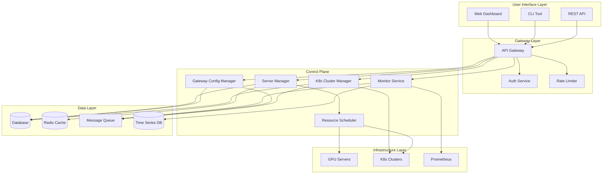
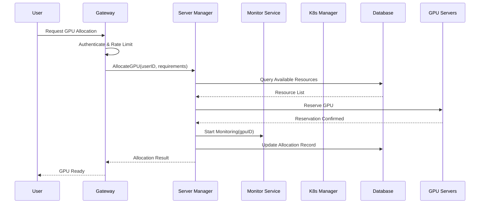

# Design Document: GPU Compute Platform

## Overview

GPU算力管理平台是一个综合性的基础设施管理平台，旨在提供GPU服务器资源的统一管理、业务可靠性监控、API网关配置以及Kubernetes集群管理能力。平台采用微服务架构，通过统一的控制平面实现对异构GPU资源的调度、监控和运维管理，支持多租户场景下的资源隔离与配额管理。

## Architecture

### System Architecture Overview



### Component Interaction Sequence



## Components and Interfaces

### Component 1: Server Manager

**Purpose**: 管理GPU服务器资源的生命周期，包括注册、状态监控、资源分配和回收。

**Interface**:
```pascal
INTERFACE IServerManager
  PROCEDURE registerServer(serverInfo: ServerInfo): Result
  PROCEDURE unregisterServer(serverId: UUID): Result
  PROCEDURE getServerStatus(serverId: UUID): ServerStatus
  PROCEDURE listServers(filter: ServerFilter): List<Server>
  PROCEDURE allocateGPU(request: AllocationRequest): AllocationResult
  PROCEDURE releaseGPU(allocationId: UUID): Result
  PROCEDURE updateServerMetrics(serverId: UUID, metrics: ServerMetrics): Result
END INTERFACE
```

**Responsibilities**:
- GPU服务器注册与发现
- 服务器健康状态检查
- GPU资源分配与调度
- 资源使用统计与计费数据收集

### Component 2: Monitor Service

**Purpose**: 监控业务运行状态和系统可靠性，提供告警和通知能力。

**Interface**:
```pascal
INTERFACE IMonitorService
  PROCEDURE collectMetrics(source: MetricSource): Metrics
  PROCEDURE defineAlert(rule: AlertRule): Result
  PROCEDURE getAlerts(filter: AlertFilter): List<Alert>
  PROCEDURE acknowledgeAlert(alertId: UUID): Result
  PROCEDURE getHealthStatus(targetId: UUID): HealthStatus
  PROCEDURE subscribeEvents(subscriber: Subscriber): Result
END INTERFACE
```

**Responsibilities**:
- 实时指标采集与存储
- 告警规则评估与触发
- 健康检查与故障检测
- 事件通知与订阅管理

### Component 3: Gateway Config Manager

**Purpose**: 管理API网关配置，支持路由规则、限流策略和认证配置。

**Interface**:
```pascal
INTERFACE IGatewayConfigManager
  PROCEDURE createRoute(route: RouteConfig): Result
  PROCEDURE updateRoute(routeId: UUID, route: RouteConfig): Result
  PROCEDURE deleteRoute(routeId: UUID): Result
  PROCEDURE listRoutes(filter: RouteFilter): List<Route>
  PROCEDURE createRateLimitPolicy(policy: RateLimitPolicy): Result
  PROCEDURE applyConfig(gatewayId: UUID): Result
  PROCEDURE rollbackConfig(gatewayId: UUID, version: UUID): Result
END INTERFACE
```

**Responsibilities**:
- 路由配置管理
- 限流策略配置
- 配置版本控制与回滚
- 配置热更新

### Component 4: K8s Cluster Manager

**Purpose**: 管理Kubernetes集群，支持集群注册、节点管理和工作负载调度。

**Interface**:
```pascal
INTERFACE IK8sClusterManager
  PROCEDURE registerCluster(cluster: ClusterInfo): Result
  PROCEDURE unregisterCluster(clusterId: UUID): Result
  PROCEDURE getClusterStatus(clusterId: UUID): ClusterStatus
  PROCEDURE listClusters(filter: ClusterFilter): List<Cluster>
  PROCEDURE deployWorkload(clusterId: UUID, workload: WorkloadSpec): Result
  PROCEDURE scaleWorkload(workloadId: UUID, replicas: Integer): Result
  PROCEDURE getNodeMetrics(clusterId: UUID): List<NodeMetrics>
END INTERFACE
```

**Responsibilities**:
- 多集群注册与管理
- 工作负载部署与调度
- 节点资源监控
- 集群版本升级与维护

## Data Models

### Model 1: Server

```pascal
STRUCTURE Server
  id: UUID
  name: String
  ip: String
  port: Integer
  gpuCount: Integer
  gpuModel: String
  totalMemory: Long
  status: ServerStatus
  createdAt: DateTime
  updatedAt: DateTime
END STRUCTURE

ENUM ServerStatus
  ONLINE
  OFFLINE
  MAINTENANCE
  ERROR
END ENUM
```

**Validation Rules**:
- name: 非空，长度1-64字符
- ip: 有效IPv4或IPv6地址
- port: 1-65535范围
- gpuCount: 大于等于0

### Model 2: GPU

```pascal
STRUCTURE GPU
  id: UUID
  serverId: UUID
  index: Integer
  model: String
  memory: Long
  usedMemory: Long
  status: GPUStatus
  allocatedTo: UUID | NULL
END STRUCTURE

ENUM GPUStatus
  IDLE
  BUSY
  ERROR
  RESERVED
END ENUM
```

**Validation Rules**:
- index: 0到gpuCount-1范围
- memory: 大于0
- usedMemory: 0到memory范围

### Model 3: Allocation

```pascal
STRUCTURE Allocation
  id: UUID
  userId: UUID
  gpuId: UUID
  serverId: UUID
  requestedAt: DateTime
  allocatedAt: DateTime
  expiresAt: DateTime
  status: AllocationStatus
  metadata: Map<String, String>
END STRUCTURE

ENUM AllocationStatus
  PENDING
  ACTIVE
  RELEASED
  EXPIRED
  FAILED
END ENUM
```

### Model 4: Alert

```pascal
STRUCTURE Alert
  id: UUID
  ruleId: UUID
  severity: AlertSeverity
  source: String
  message: String
  triggeredAt: DateTime
  acknowledgedAt: DateTime | NULL
  acknowledgedBy: UUID | NULL
  status: AlertStatus
END STRUCTURE

ENUM AlertSeverity
  INFO
  WARNING
  ERROR
  CRITICAL
END ENUM

ENUM AlertStatus
  FIRING
  RESOLVED
  ACKNOWLEDGED
END ENUM
```

### Model 5: RouteConfig

```pascal
STRUCTURE RouteConfig
  id: UUID
  name: String
  path: String
  method: HttpMethod
  upstream: UpstreamConfig
  rateLimit: RateLimitPolicy | NULL
  authRequired: Boolean
  timeout: Integer
  retryPolicy: RetryPolicy | NULL
END STRUCTURE

STRUCTURE UpstreamConfig
  targets: List<UpstreamTarget>
  loadBalance: LoadBalanceStrategy
  healthCheck: HealthCheckConfig
END STRUCTURE
```

### Model 6: Cluster

```pascal
STRUCTURE Cluster
  id: UUID
  name: String
  apiServer: String
  kubeconfig: String
  version: String
  nodeCount: Integer
  gpuNodeCount: Integer
  status: ClusterStatus
  labels: Map<String, String>
END STRUCTURE

ENUM ClusterStatus
  HEALTHY
  DEGRADED
  UNHEALTHY
  UNKNOWN
END ENUM
```

## Algorithmic Pseudocode

### Algorithm 1: GPU Resource Allocation

```pascal
PROCEDURE allocateGPU(request: AllocationRequest): AllocationResult
  INPUT: request containing userId, gpuModel, memoryRequired, duration
  OUTPUT: AllocationResult containing success/failure and allocation details
  
  SEQUENCE
    // Step 1: Validate request
    IF NOT validateAllocationRequest(request) THEN
      RETURN AllocationResult.Error("Invalid request parameters")
    END IF
    
    // Step 2: Check user quota
    userQuota ← getUserQuota(request.userId)
    currentUsage ← getUserCurrentUsage(request.userId)
    
    IF currentUsage >= userQuota THEN
      RETURN AllocationResult.Error("User quota exceeded")
    END IF
    
    // Step 3: Find available GPUs
    candidates ← findAvailableGPUs(request.gpuModel, request.memoryRequired)
    
    IF candidates.isEmpty() THEN
      RETURN AllocationResult.Error("No available GPU resources")
    END IF
    
    // Step 4: Select best GPU using scoring algorithm
    selectedGPU ← selectBestGPU(candidates)
    
    // Step 5: Create allocation record
    allocation ← createAllocationRecord(
      userId: request.userId,
      gpuId: selectedGPU.id,
      serverId: selectedGPU.serverId,
      duration: request.duration
    )
    
    // Step 6: Reserve GPU atomically
    success ← atomicReserveGPU(selectedGPU.id, allocation.id)
    
    IF NOT success THEN
      RETURN AllocationResult.Error("GPU reservation failed, please retry")
    END IF
    
    // Step 7: Start monitoring for this allocation
    startMonitoring(allocation.id, selectedGPU.id)
    
    RETURN AllocationResult.Success(allocation)
  END SEQUENCE
END PROCEDURE
```

**Preconditions**:
- request is non-null and well-formed
- request.userId exists in the system
- request.memoryRequired is positive

**Postconditions**:
- If successful: GPU status changed to BUSY, allocation record created
- If failed: No state change to any GPU
- Allocation expiry time is set correctly

**Loop Invariants**: N/A

### Algorithm 2: GPU Selection Scoring

```pascal
PROCEDURE selectBestGPU(candidates: List<GPU>): GPU
  INPUT: list of available GPU candidates
  OUTPUT: best GPU based on scoring
  
  SEQUENCE
    bestGPU ← NULL
    bestScore ← -1
    
    FOR each gpu IN candidates DO
      // Invariant: bestGPU has highest score among processed GPUs
      ASSERT bestScore = -1 OR score(bestGPU) = bestScore
      
      score ← calculateGPUScore(gpu)
      
      IF score > bestScore THEN
        bestScore ← score
        bestGPU ← gpu
      END IF
    END FOR
    
    ASSERT bestGPU ≠ NULL
    RETURN bestGPU
  END SEQUENCE
END PROCEDURE

PROCEDURE calculateGPUScore(gpu: GPU): Integer
  INPUT: GPU to score
  OUTPUT: score value (higher is better)
  
  SEQUENCE
    score ← 0
    
    // Prefer GPUs with more free memory
    freeMemoryRatio ← gpu.memory - gpu.usedMemory / gpu.memory
    score ← score + freeMemoryRatio * 100
    
    // Prefer GPUs on servers with lower load
    serverLoad ← getServerLoad(gpu.serverId)
    score ← score - serverLoad * 50
    
    // Prefer GPUs that have been idle longer
    idleTime ← getIdleTime(gpu.id)
    score ← score + MIN(idleTime / 3600, 10)
    
    RETURN FLOOR(score)
  END SEQUENCE
END PROCEDURE
```

**Preconditions**:
- candidates list is non-empty
- All GPUs in candidates have status = IDLE

**Postconditions**:
- Returns a GPU from the candidates list
- Returned GPU has highest score among all candidates

**Loop Invariants**:
- At each iteration: bestScore equals the score of bestGPU
- At each iteration: bestGPU has the highest score among all processed GPUs

### Algorithm 3: Health Check and Alerting

```pascal
PROCEDURE performHealthCheck(targetId: UUID): HealthStatus
  INPUT: target identifier (server, cluster, or service)
  OUTPUT: health status result
  
  SEQUENCE
    target ← getTargetById(targetId)
    
    IF target = NULL THEN
      RETURN HealthStatus.UNKNOWN
    END IF
    
    checks ← getHealthChecks(target.type)
    results ← empty list
    
    FOR each check IN checks DO
      // Invariant: results contains outcomes of all previous checks
      result ← executeCheck(target, check)
      results.add(result)
      
      IF result.status = CRITICAL THEN
        // Early termination on critical failure
        triggerAlert(target, result)
        RETURN HealthStatus.UNHEALTHY
      END IF
    END FOR
    
    overallStatus ← aggregateResults(results)
    
    IF overallStatus ≠ target.lastStatus THEN
      recordStatusChange(target, overallStatus)
      
      IF overallStatus = UNHEALTHY THEN
        triggerAlert(target, overallStatus)
      END IF
    END IF
    
    RETURN overallStatus
  END SEQUENCE
END PROCEDURE
```

**Preconditions**:
- targetId is a valid identifier
- Health check configurations exist for the target type

**Postconditions**:
- Health status is recorded in the database
- Alert is triggered if status changed to UNHEALTHY
- All check results are persisted

**Loop Invariants**:
- results list contains exactly the checks executed so far
- No critical check has been skipped

### Algorithm 4: Gateway Configuration Update

```pascal
PROCEDURE applyGatewayConfig(gatewayId: UUID): Result
  INPUT: gateway identifier
  OUTPUT: success or failure result
  
  SEQUENCE
    // Step 1: Validate configuration
    config ← getPendingConfig(gatewayId)
    
    IF config = NULL THEN
      RETURN Result.Error("No pending configuration")
    END IF
    
    validationErrors ← validateConfig(config)
    
    IF NOT validationErrors.isEmpty() THEN
      RETURN Result.Error("Configuration validation failed", validationErrors)
    END IF
    
    // Step 2: Create backup of current config
    currentConfig ← getCurrentConfig(gatewayId)
    backupId ← createBackup(gatewayId, currentConfig)
    
    // Step 3: Apply new configuration
    applyResult ← applyConfigToGateway(gatewayId, config)
    
    IF NOT applyResult.success THEN
      // Rollback on failure
      restoreBackup(gatewayId, backupId)
      RETURN Result.Error("Failed to apply configuration", applyResult.error)
    END IF
    
    // Step 4: Verify configuration is active
    wait(5000)  // Wait 5 seconds for propagation
    
    activeConfig ← getActiveConfig(gatewayId)
    
    IF activeConfig.version ≠ config.version THEN
      restoreBackup(gatewayId, backupId)
      RETURN Result.Error("Configuration verification failed")
    END IF
    
    // Step 5: Update config status
    markConfigAsActive(config.id)
    deleteBackup(backupId)
    
    RETURN Result.Success()
  END SEQUENCE
END PROCEDURE
```

**Preconditions**:
- gatewayId exists and is accessible
- Pending configuration exists for the gateway

**Postconditions**:
- If successful: New configuration is active, old backup removed
- If failed: Original configuration is restored
- Configuration history is preserved

### Algorithm 5: K8s Workload Deployment

```pascal
PROCEDURE deployWorkload(clusterId: UUID, spec: WorkloadSpec): Result
  INPUT: cluster identifier and workload specification
  OUTPUT: deployment result
  
  SEQUENCE
    // Step 1: Validate cluster availability
    cluster ← getCluster(clusterId)
    
    IF cluster = NULL THEN
      RETURN Result.Error("Cluster not found")
    END IF
    
    IF cluster.status ≠ HEALTHY THEN
      RETURN Result.Error("Cluster is not healthy")
    END IF
    
    // Step 2: Validate resource requirements
    nodeMetrics ← getNodeMetrics(clusterId)
    availableResources ← calculateAvailableResources(nodeMetrics)
    
    IF NOT hasSufficientResources(availableResources, spec.resources) THEN
      RETURN Result.Error("Insufficient cluster resources")
    END IF
    
    // Step 3: Generate Kubernetes manifests
    manifests ← generateManifests(spec)
    
    // Step 4: Apply to cluster
    FOR each manifest IN manifests DO
      // Invariant: All previous manifests applied successfully
      result ← applyManifest(cluster, manifest)
      
      IF NOT result.success THEN
        // Rollback applied manifests
        rollbackDeployment(cluster, manifests, manifest)
        RETURN Result.Error("Deployment failed", result.error)
      END IF
    END FOR
    
    // Step 5: Wait for rollout
    rolloutResult ← waitForRollout(cluster, spec.namespace, spec.name)
    
    IF NOT rolloutResult.success THEN
      rollbackDeployment(cluster, manifests, NULL)
      RETURN Result.Error("Rollout failed", rolloutResult.error)
    END IF
    
    // Step 6: Record deployment
    recordDeployment(clusterId, spec)
    
    RETURN Result.Success()
  END SEQUENCE
END PROCEDURE
```

**Preconditions**:
- clusterId references a valid cluster
- spec contains valid workload definition
- User has deployment permissions

**Postconditions**:
- If successful: Workload is running on the cluster
- If failed: No resources left in partially deployed state
- Deployment record is created

**Loop Invariants**:
- All manifests before current index are applied
- No manifest after current index is applied

## Key Functions with Formal Specifications

### Function 1: validateAllocationRequest()

```pascal
FUNCTION validateAllocationRequest(request: AllocationRequest): Boolean
  INPUT: allocation request to validate
  OUTPUT: true if valid, false otherwise
END FUNCTION
```

**Preconditions**:
- request parameter is provided (may be null)

**Postconditions**:
- Returns true if and only if:
  - request is non-null
  - request.userId is valid UUID
  - request.memoryRequired > 0
  - request.duration > 0 AND request.duration <= MAX_DURATION
- No side effects on request parameter

### Function 2: atomicReserveGPU()

```pascal
FUNCTION atomicReserveGPU(gpuId: UUID, allocationId: UUID): Boolean
  INPUT: GPU to reserve and allocation identifier
  OUTPUT: true if reservation succeeded
END FUNCTION
```

**Preconditions**:
- gpuId references an existing GPU
- allocationId is unique

**Postconditions**:
- Returns true if and only if GPU status changed from IDLE to BUSY
- If returns true: GPU.allocatedTo = allocationId
- If returns false: GPU state unchanged
- Operation is atomic (no partial state)

### Function 3: calculateAvailableResources()

```pascal
FUNCTION calculateAvailableResources(metrics: List<NodeMetrics>): Resources
  INPUT: list of node metrics from cluster
  OUTPUT: aggregate available resources
END FUNCTION
```

**Preconditions**:
- metrics list is non-null

**Postconditions**:
- Returns Resources with:
  - cpu = sum(node.allocatableCpu - node.usedCpu) for all nodes
  - memory = sum(node.allocatableMemory - node.usedMemory) for all nodes
  - gpu = count of nodes with available GPU capacity
- All values are non-negative

## Example Usage

### Example 1: GPU Allocation Workflow

```pascal
SEQUENCE
  // User requests GPU allocation
  request ← AllocationRequest(
    userId: "user-123",
    gpuModel: "NVIDIA-A100",
    memoryRequired: 40960,
    duration: 3600
  )
  
  result ← allocateGPU(request)
  
  IF result.success THEN
    DISPLAY "GPU allocated: " + result.allocation.gpuId
    DISPLAY "Server: " + result.allocation.serverId
    DISPLAY "Expires at: " + result.allocation.expiresAt
  ELSE
    DISPLAY "Allocation failed: " + result.error
  END IF
END SEQUENCE
```

### Example 2: Health Monitoring Setup

```pascal
SEQUENCE
  // Define alert rule for GPU temperature
  rule ← AlertRule(
    name: "GPU-High-Temperature",
    condition: "gpu_temperature > 85",
    severity: WARNING,
    duration: 300
  )
  
  defineAlert(rule)
  
  // Subscribe to alerts
  subscriber ← Subscriber(
    endpoint: "https://notification.example.com/webhook",
    events: ["alert.triggered", "alert.resolved"]
  )
  
  subscribeEvents(subscriber)
END SEQUENCE
```

### Example 3: Gateway Route Configuration

```pascal
SEQUENCE
  // Create new API route
  route ← RouteConfig(
    name: "gpu-api",
    path: "/api/v1/gpu/*",
    method: ANY,
    upstream: UpstreamConfig(
      targets: ["gpu-service:8080"],
      loadBalance: ROUND_ROBIN
    ),
    rateLimit: RateLimitPolicy(
      requestsPerSecond: 100,
      burst: 200
    ),
    authRequired: true
  )
  
  createRoute(route)
  applyConfig(gatewayId: "main-gateway")
END SEQUENCE
```

### Example 4: K8s Workload Deployment

```pascal
SEQUENCE
  // Deploy GPU training job
  workload ← WorkloadSpec(
    name: "model-training",
    namespace: "ml-jobs",
    image: "training:v1.0",
    replicas: 4,
    resources: ResourceRequirements(
      cpu: "4",
      memory: "16Gi",
      gpu: 1
    ),
    gpuModel: "NVIDIA-A100"
  )
  
  result ← deployWorkload(clusterId: "prod-cluster", spec: workload)
  
  IF result.success THEN
    DISPLAY "Workload deployed successfully"
  ELSE
    DISPLAY "Deployment failed: " + result.error
  END IF
END SEQUENCE
```

## Correctness Properties


*A property is a characteristic or behavior that should hold true across all valid executions of a system-essentially, a formal statement about what the system should do. Properties serve as the bridge between human-readable specifications and machine-verifiable correctness guarantees.*


### Property 1: GPU Allocation Consistency

For any GPU, the GPU status equals BUSY if and only if there exists an active allocation referencing that GPU.

**Validates: Requirements 2.5, 2.6**

### Property 2: Resource Quota Enforcement

For any user, the count of active allocations for that user shall not exceed the user's quota limit.

**Validates: Requirements 2.2**

### Property 3: Allocation Exclusivity

For any two active allocations, the GPU IDs shall be different (each GPU can only have one active allocation at a time).

**Validates: Requirements 2.6**

### Property 4: Configuration Atomicity

For any gateway configuration update operation, the system shall end in either the new configuration state or the original configuration state, never a partial state.

**Validates: Requirements 9.7**

### Property 5: Deployment Consistency

After successful workload deployment, the actual cluster state shall match the workload specification.

**Validates: Requirements 11.1, 11.6**

### Property 6: Alert Uniqueness

For any alert rule and alert source combination, at most one FIRING status alert shall exist at any given time.

**Validates: Requirements 5.6**

### Property 7: Server Registration Validation

For any server registration request, the Server_Manager shall accept the request if and only if all validation rules pass (valid IP, name length 1-64, port 1-65535, GPU count >= 0).

**Validates: Requirements 1.1, 1.6, 1.7, 17.1, 17.2, 17.3**

### Property 8: Server Unregistration Protection

For any server unregistration request, the Server_Manager shall reject the request if and only if there exist active GPU allocations on that server.

**Validates: Requirements 1.3, 1.4**

### Property 9: Server List Filtering

For any server list query with filters, all returned servers shall match all specified filter criteria (status and/or GPU model).

**Validates: Requirements 1.5**

### Property 10: GPU Selection Optimality

For any GPU allocation request with multiple candidate GPUs, the selected GPU shall have the highest score among all candidates.

**Validates: Requirements 2.8, 3.5**

### Property 11: GPU Scoring Factors

For any GPU scoring calculation, the score shall increase with higher free memory ratio, decrease with higher server load, and increase with longer idle time.

**Validates: Requirements 3.1, 3.2, 3.3, 3.4**

### Property 12: GPU Release State Transition

For any GPU release operation, after completion the GPU status shall be IDLE and the allocation status shall be RELEASED.

**Validates: Requirements 2.7**

### Property 13: Health Check Alert Triggering

For any health check that detects a critical failure, the Monitor_Service shall trigger an alert and return UNHEALTHY status.

**Validates: Requirements 4.2**

### Property 14: Health Check Result Persistence

For any health check execution, all check results shall be persisted to storage.

**Validates: Requirements 4.6**

### Property 15: Alert Rule Validation

For any alert rule definition, the Monitor_Service shall accept the rule if and only if the condition expression is valid.

**Validates: Requirements 5.1**

### Property 16: Alert State Transitions

For any alert, when the alert condition is met, the alert status shall be FIRING; when acknowledged, the status shall be ACKNOWLEDGED; when the condition is no longer met, the status shall be RESOLVED.

**Validates: Requirements 5.2, 5.4, 5.5**

### Property 17: Route Configuration Validation

For any route configuration creation, the Gateway_Config_Manager shall accept the configuration if and only if the path and upstream configuration are valid.

**Validates: Requirements 7.1**

### Property 18: Route Configuration Versioning

For any route configuration update, a new version shall be created with a higher version number.

**Validates: Requirements 7.2**

### Property 19: Route Deletion

For any route deletion request where the route exists, the route shall no longer exist after the operation completes.

**Validates: Requirements 7.3**

### Property 20: Route Filtering

For any route list query with filters, all returned routes shall match the specified name and/or path filter criteria.

**Validates: Requirements 7.4**

### Property 21: Rate Limit Validation

For any rate limit policy creation, the Gateway_Config_Manager shall accept the policy if and only if the requests per second and burst values are within reasonable bounds.

**Validates: Requirements 8.1**

### Property 22: Rate Limit Association

For any route with an associated rate limit policy, the association shall be retrievable.

**Validates: Requirements 8.2**

### Property 23: Config Apply Validation

For any configuration apply request, the Gateway_Config_Manager shall validate the configuration before attempting to apply it.

**Validates: Requirements 9.1**

### Property 24: Config Backup Before Apply

For any successful configuration apply operation, a backup of the previous configuration shall exist.

**Validates: Requirements 9.3**

### Property 25: Config Rollback on Failure

For any configuration apply operation that fails, the system shall be in the backup configuration state.

**Validates: Requirements 9.4, 9.6**

### Property 26: Config Verification

For any successful configuration apply operation, the active configuration version shall match the applied configuration version.

**Validates: Requirements 9.5**

### Property 27: Cluster Registration Validation

For any cluster registration request with valid cluster information, the K8s_Cluster_Manager shall return a valid cluster ID.

**Validates: Requirements 10.1**

### Property 28: Cluster List Filtering

For any cluster list query with filters, all returned clusters shall match the specified status and/or label filter criteria.

**Validates: Requirements 10.3**

### Property 29: Cluster Unregistration Protection

For any cluster unregistration request, the K8s_Cluster_Manager shall reject the request if and only if there exist active workloads on that cluster.

**Validates: Requirements 10.4**

### Property 30: Workload Deployment Rejection

For any workload deployment request to a non-HEALTHY cluster or a cluster with insufficient resources, the K8s_Cluster_Manager shall reject the request with an appropriate error.

**Validates: Requirements 11.2, 11.3**

### Property 31: Workload Deployment Rollback

For any workload deployment that fails mid-operation, all already-applied resources shall be cleaned up.

**Validates: Requirements 11.4**

### Property 32: Replica Count Validation

For any workload scaling request, the K8s_Cluster_Manager shall accept the request if and only if the replica count is between 1 and 1000 inclusive.

**Validates: Requirements 12.3**

### Property 33: Available Resources Calculation

For any cluster, the calculated available resources shall equal the sum of (allocatable - used) for all nodes.

**Validates: Requirements 13.2**

### Property 34: GPU Node Count

For any cluster, the GPU node count shall equal the number of nodes with available GPU capacity.

**Validates: Requirements 13.3**

### Property 35: JWT Authentication

For any API request, the Gateway shall accept the request if and only if a valid JWT token is provided.

**Validates: Requirements 14.1**

### Property 36: Allocation Authorization

For any GPU allocation request, the Server_Manager shall check and enforce the user's allocation permission.

**Validates: Requirements 14.2**

### Property 37: Audit Log Completeness

For any configuration change operation, the audit log entry shall contain the operator, timestamp, operation type, and change content.

**Validates: Requirements 15.1**

### Property 38: GPU Index Validation

For any GPU, the GPU index shall be between 0 and gpuCount-1 inclusive.

**Validates: Requirements 17.4**

### Property 39: GPU Memory Validation

For any GPU, the memory value shall be greater than 0, and the used memory shall be between 0 and total memory inclusive.

**Validates: Requirements 17.5, 17.6**

## Error Handling

### Error Scenario 1: GPU Reservation Conflict

**Condition**: Multiple requests attempt to reserve the same GPU simultaneously
**Response**: atomicReserveGPU returns false for all but one request
**Recovery**: Failed requests receive retry suggestion with exponential backoff

### Error Scenario 2: Cluster Connection Failure

**Condition**: K8s cluster becomes unreachable during operation
**Response**: Operation fails with CONNECTION_ERROR, cluster status set to UNKNOWN
**Recovery**: Background reconciliation loop attempts to restore connection

### Error Scenario 3: Configuration Validation Failure

**Condition**: Gateway configuration contains invalid or conflicting rules
**Response**: Validation errors returned without applying configuration
**Recovery**: User must fix validation errors and resubmit

### Error Scenario 4: Resource Exhaustion

**Condition**: Insufficient GPU resources to fulfill allocation request
**Response**: Allocation fails with RESOURCE_UNAVAILABLE error
**Recovery**: Request queued for retry when resources become available

## Testing Strategy

### Unit Testing Approach

- Test each component interface method independently
- Mock external dependencies (database, K8s API, GPU servers)
- Achieve minimum 80% code coverage
- Focus on edge cases: null inputs, boundary values, error conditions

### Property-Based Testing Approach

**Property Test Library**: fast-check

**Key Properties to Test**:
- GPU allocation always produces valid allocation records
- Health check never returns invalid status
- Configuration rollback restores exact previous state
- Resource calculation is monotonic with respect to node additions

### Integration Testing Approach

- Test complete workflows end-to-end
- Use test containers for database and message queue
- Simulate K8s cluster with kind (Kubernetes in Docker)
- Verify alert triggering and notification delivery

## Performance Considerations

- GPU allocation should complete within 500ms under normal load
- Health checks should not exceed 30-second intervals
- Gateway configuration updates should propagate within 10 seconds
- Support up to 10,000 concurrent GPU allocations
- Time series database should handle 1M metrics per minute

## Security Considerations

- All API endpoints require authentication (JWT tokens)
- GPU allocation requests are subject to RBAC
- K8s kubeconfig stored encrypted at rest
- Audit logging for all configuration changes
- Rate limiting to prevent DoS attacks

## Dependencies

- PostgreSQL 14+: Primary database for configuration and metadata
- Redis 7+: Caching and distributed locks
- Prometheus: Metrics collection and alerting
- Kubernetes API: Cluster management
- NATS: Message queue for event distribution
- Go 1.21+: Primary implementation language
